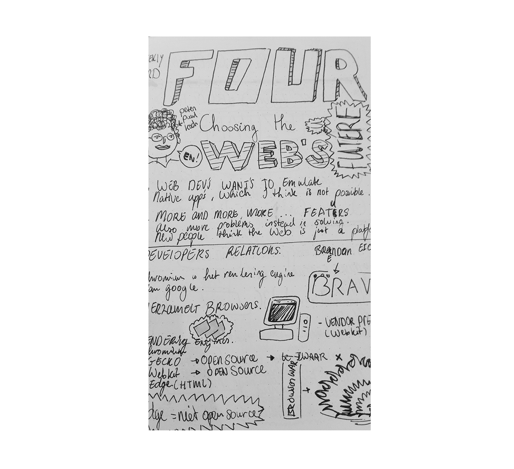
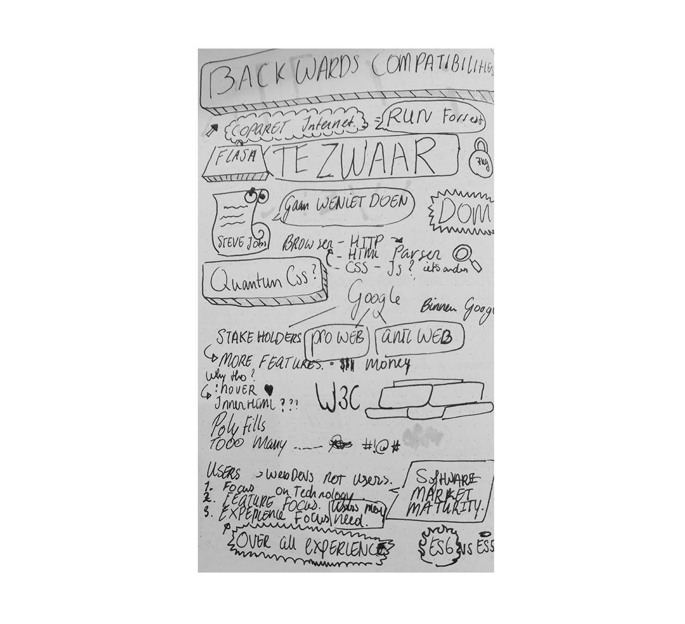

[Vorige sketchnote](./tituswormer.md) | [Volgende sketchnote](tam.md)

# 1. Peter Paul Koch - Browsers
Peter heeft verteld over hoe en waarom browser verschillende
richtlijnen hebben in bijvoorbeeld css/js. Met zulke ontwikkelingen in de browsers hoe kunnen wij als developers hier goed me omgaan?

# Sketchnotes

